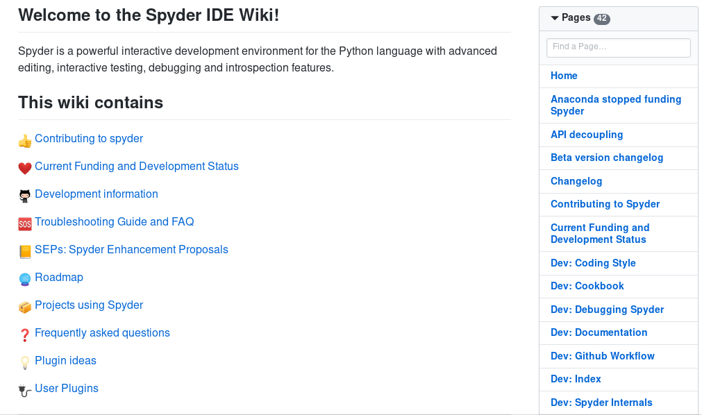
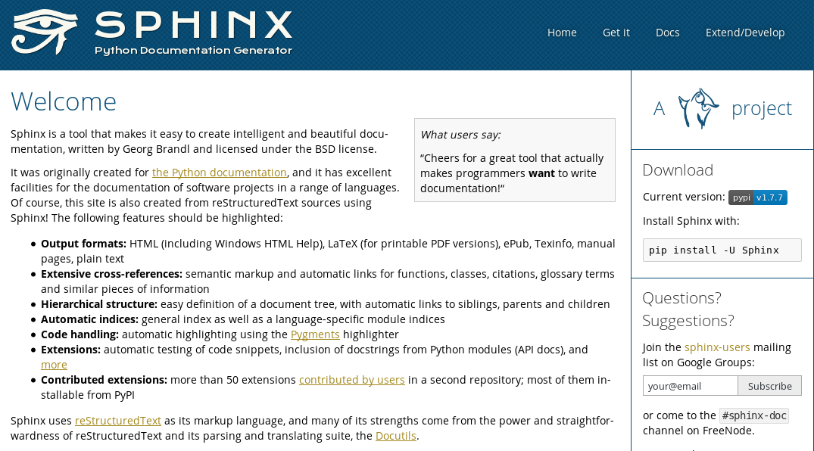

Desenvolvimento Aberto
===

##### Documentação de software

###### Igor dos Santos Montagner ( [igorsm1@insper.edu.br](mailto:igorsm1@insper.edu.br) )

---

Desenvolvimento Aberto
===

##### (A ausência de d)ocumentação de software

###### Igor dos Santos Montagner ( [igorsm1@insper.edu.br](mailto:igorsm1@insper.edu.br) )

---
# Avisos

* Na próxima semana trabalharemos de novo em projetos externos

### Se sua dupla/trio ainda não enviou um PR, faça-o o mais rápido possível

* Continuaremos alternando semanas de trabalho em projetos externos e atividades de "treinamento" até a PI

---
# Documentação de software

**Documentação de usuário**:

#

#

#

**Documentação de desenvolvimento**:

#

#

#

---
# Documentação de software

**Documentação de usuário**:

- Instalação
- Funcionalidades
- Onde obter ajuda

---
# Documentação de software

**Documentação de desenvolvimento**:

- Como compilar (dependências, ferramentas usadas, etc)
- Como testar (dependências, ferramentas usadas, etc)
- Estilo de código e outras orientações relacionadas
- Organização do código e arquitetura da aplicação

---
# Documentação de software

Às vezes as coisas se confundem! O que vocês colocariam na documentação de usuário do *Python*?

E na de desenvolvedor?

---
# Exemplo: Spyder

https://pythonhosted.org/spyder/

---
# Exemplo: Spyder

https://github.com/spyder-ide/spyder/wiki

---
# Sistemas de documentação

[Sphinx](http://www.sphinx-doc.org/en/master/)

---
# Sistemas de documentação

[Mkdocs](www.mkdocs.org)

---
# Sistemas de documentação (hospedagem)

[https://readthedocs.org/](https://readthedocs.org/)

---
# Atividade de Hoje

Vocês receberão um *zip* com o código de um software e zero instruções. Vocês deverão:

1. Aprender como rodar o software
2. Documentar os passos que vocês seguiram para fazê-lo
3. Fazer uma análise crítica do projeto com relação a
	- Arquitetura
	- Qualidade do código
	- Segurança da solução
4. Criar uma documentação de usuário e uma de desenvolvimento baseado em suas anotações

---

# Objetivos desta atividade

1. Entender na prática a necessidade de documentação;
2. Praticar suas habilidades de leitura de código e entendimento da arquitetura de uma aplicação desconhecida;
3. Obter primeira experiência com documentação de desenvolvimento e de usuário.

---

# Não são objetivos desta atividade

1. Mostrar nenhum tipo de boa prática de programação
2. Melhorar o software analisado
3. Criticar o desenvolvedor que trabalhou antes no projeto

---

# Passo 1 - explorar o projeto

Vamos fazer o roteiro **pelo menos até a pergunta 5**: 

1. Aprender como rodar o software
2. Documentar os passos que vocês seguiram para fazê-lo

**Duração**: 30~45 minutos

---
# Passo 2 - identificar pontos de melhorias

3. Fazer uma análise crítica do projeto com relação a
	- Arquitetura
	- Qualidade do código
	- Segurança da solução

**Duração**: 15 minutos para reolhar o código, 15 minutos para discussões.

---

# Passo 3 - estado atual deste sistema

https://github.com/Insper/servidor-de-desafios

---
Desenvolvimento Aberto
===

##### Documentação de software

###### Igor dos Santos Montagner ( [igorsm1@insper.edu.br](mailto:igorsm1@insper.edu.br) )
